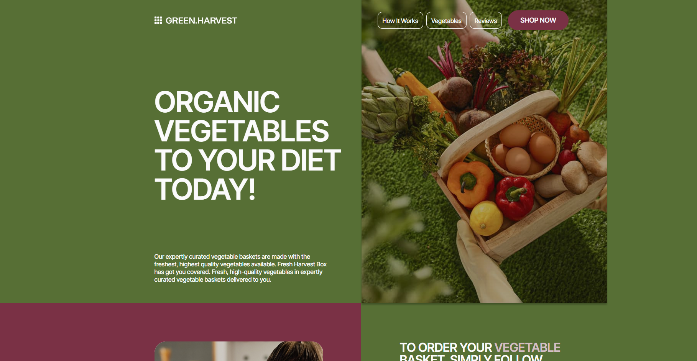
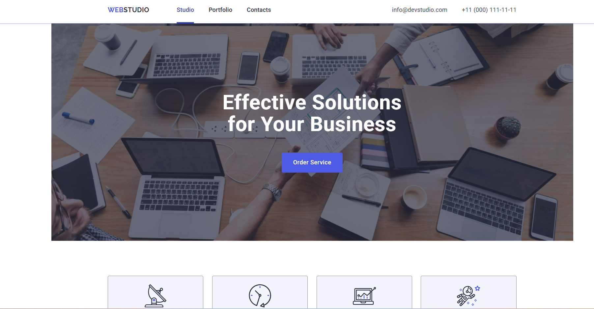
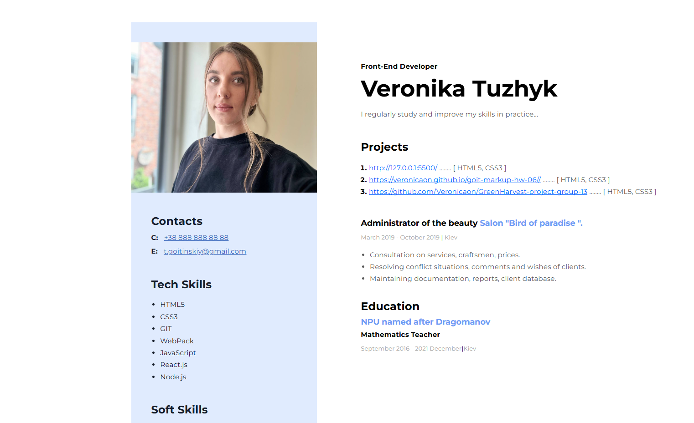

# [ GreenHarvest]( https://github.com/Veronicaon/GreenHarvest-project-group-13) 

* GreenHarvest is a group project created to support ecological farming.  The main goal is to develop an informative and user-friendly site with an emphasis on accessibility and visual appeal.

 * My duties in the project:
  • Layout of pages according to the layout
  • Adaptive design (correct display on mobile and desktop devices)
  • Work with animations and effects 
  • Optimization of code and styles

 * Technologies:
 ✅ HTML5 — semantic and valid markup
 ✅ CSS3 — styling, adaptive design, animations
 ✅ Flexbox — for building a layout
 ✅ Git and team development

# [WebStudio](https://veronicaon.github.io/goit-markup-hw-06/) 

* WebStudio is a responsive multi-page website for a digital agency.

 *  Technologies: HTML, CSS (Flexbox)
 *  Features: semantic layout, adaptive design, interactive elements
 *  Implemented: main page with sections,

# [Resume](https://drive.google.com/drive/folders/1MN_DNfIu5YwsA7d8rtfZpgVdWTjdyUJ8?usp=drive_link) 

 *  I designed a resume from scratch using HTML and CSS. 
 *  I styled the headers, sections, buttons, and used Flexbox to position elements.
 *  I worked with fonts, colors, and responsiveness.

## Thanks for stopping by!

# Contact Info:

- Email:veronikatuzik@gmail.com
- LinkedIn:[Veronicaon](https://www.linkedin.com/in/veronika-tuzhyk-534249302/)
